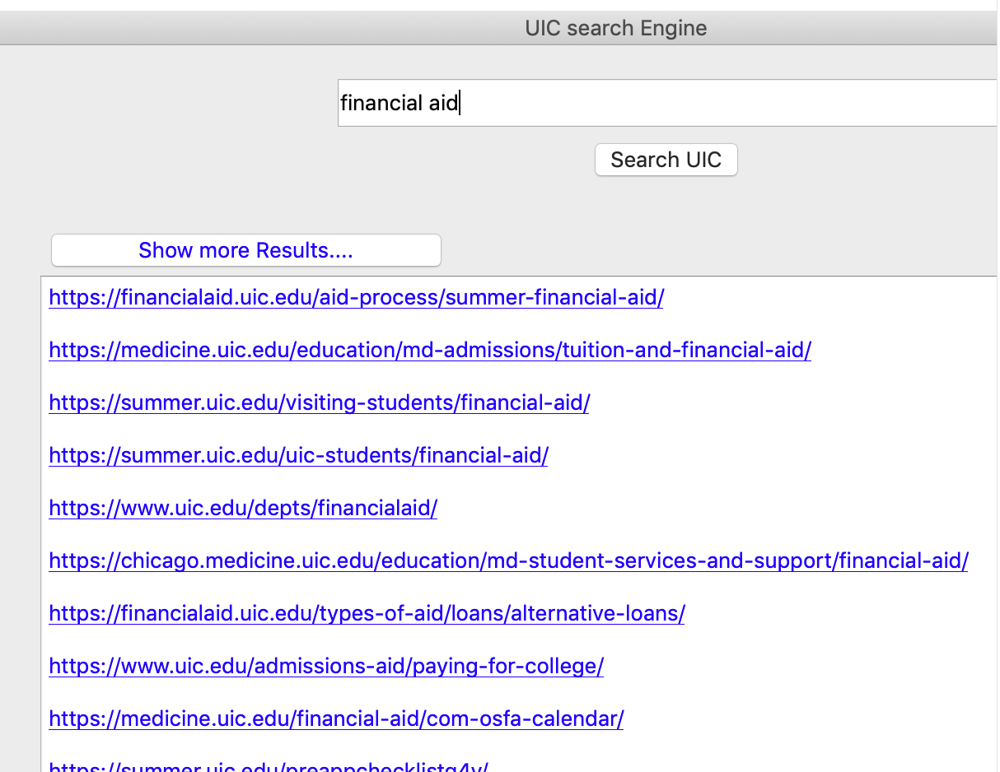

# Search Engine

## search engine design based on pagerank algorithm:

To design a simple search engine on uic domain (uic.edu) as part of a big data analysis project.
implementation of web crawling in uic domain then extract the documentation.indexes these documents and documents are preprocessed techniques like parsed,remove symbols, remove stop words and vectorized.
page rank is applied to uic domain graphs which are generated based on the documents.
to develop gui using python which takes input keywords and returns the most relevant pages to the query in the uic website.
the relevant page is calculated based on cosine similarity and page rank of each document.

## required packages

- **pyqt5** used to create gui(graphical user interface)
- **nltk** used to perform nlp(natural language processing) pre processing techinque
- **beautifulsoup** used to web scraping
- **requests** used to connect with gui application
- **pandas** used to read csv file and mathematical operation
- **sklearn** used to perform various algorithms
- **pickle** used to store obtained result

the above mentioned packages can be installed using `pip install package_name`

## to running the programm

simply run searchengine.py file using command :
`python searchengine.py`

# Description

the search engine has the following components:

### web spider

crawls the uic domain, indexes and generates graph of the crawled pages.

### processor

which loads individual documents, preprocess and vectorizes the documents.

### ranker

runs page rank on the uic graph, ranks the documents based on the cosine similarity and the page ranks.

### access interface

presents a graphical user interface of the search engine to the user, which accepts queries and retrieves the most relevant pages to the query.

during a normal run of the engine only ranker and access interface are active. the processed pages and documents are stored in the binary format, which are accessed by the ranker and the access interface invokes the ranker with the query user provides.

=======
